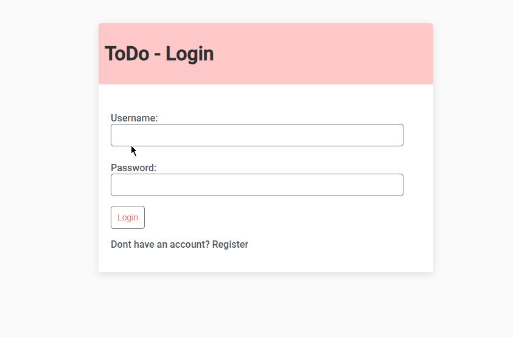

# TodoList-Registration-Login



This is a web application built with Django, HTML, and CSS, allowing users to create and manage their to-do lists. The application provides features such as user registration, login, and CRUD (Create, Read, Update, Delete) operations for tasks.

## Features

- User Registration: New users can create an account by providing their desired username and password.
- User Login: Registered users can log in using their credentials.
- Create Task: Users can create new tasks by entering a title and description.
- Read Task: Users can view their tasks, including the title, description, completion status, and creation timestamp.
- Update Task: Users can edit task details, such as the title, description, and completion status.
- Delete Task: Users can delete tasks they no longer need.

## Technology Stack

The application is built using the following technologies:

- Django
- HTML
- CSS

## Setup Instructions

To get started with the Delights-Inventory project, follow these instructions:

1. Clone the repository:

```
git clone https://github.com/JPCLima/TodoList-Registration-Login
```

2. Install the necessary dependencies by running

```
pip install django
```

3. Set up the database by running the migrations:

```
python manage.py migrate
```

4. Create a superuser account:

```
 python manage.py createsuperuser
```

5. Start the development server:

```
python manage.py runserver.
```

6. Access the project by opening a web browser and navigating to

```
http://localhost:8000/
```
